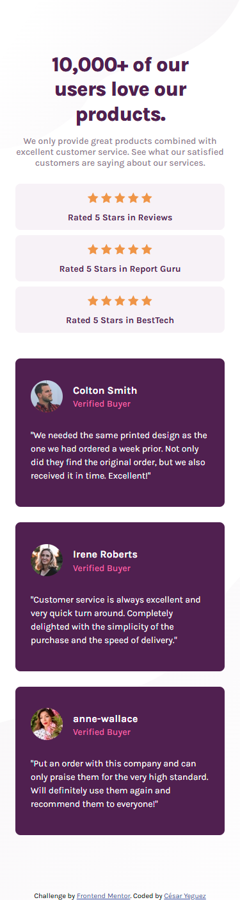
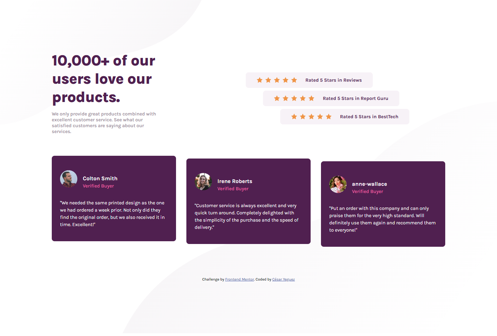

# Frontend Mentor - Social proof section solution

This is a solution to the [Social proof section challenge on Frontend Mentor](https://www.frontendmentor.io/challenges/social-proof-section-6e0qTv_bA). Frontend Mentor challenges help you improve your coding skills by building realistic projects.

## Table of contents

- [Overview](#overview)
  - [The challenge](#the-challenge)
  - [Screenshot](#screenshot)
  - [Links](#links)
- [My process](#my-process)
  - [Built with](#built-with)
  - [What I learned](#what-i-learned)
  - [Continued development](#continued-development)
  - [Useful resources](#useful-resources)
- [Author](#author)
- [Acknowledgments](#acknowledgments)

**Note: Delete this note and update the table of contents based on what sections you keep.**

## Overview

### The challenge

Users should be able to:

- View the optimal layout for the section depending on their device's screen size

### Screenshot





### Links

- Solution URL: [Add solution URL here](https://your-solution-url.com)
- Live Site URL: [Add live site URL here](https://your-live-site-url.com)

## My process

### Built with

- Semantic HTML5 markup
- CSS custom properties
- Flexbox
- 
- 
- 
- 

- 

### What I learned

- El uso de la propiedad nth-child()

```
 .ratings div:nth-child(2) {
    margin-left: 7.9375rem;
  }
  .ratings .rating:nth-child(3) {
    margin-left: 12.875rem;
  }

```

### Continued development

Me gustaría seguir mejorando en:

- Accesibilidad web (mejorar navegación con teclado y lectores de pantalla).
- Animaciones avanzadas con CSS y JavaScript.
- Uso de frameworks modernos como React o Vue.

### Useful resources

- [CSS Tricks - Responsive Design](https://css-tricks.com/snippets/css/media-queries-for-standard-devices/) - Para entender mejor los breakpoints.
- [MDN Web Docs - Flexbox](https://developer.mozilla.org/en-US/docs/Web/CSS/CSS_Flexible_Box_Layout/Basic_Concepts_of_Flexbox) - Referencia esencial para Flexbox.


## Author

- Website - [https://cesaryeguezporfolio.netlify.app/](https://www.your-site.com)
- Frontend Mentor - [https://www.frontendmentor.io/profile/cyeguez](https://www.frontendmentor.io/profile/yourusername)


## Acknowledgments

Gracias a la comunidad de Frontend Mentor por los recursos y feedback.  
Inspiración tomada de otras soluciones en la plataforma.
